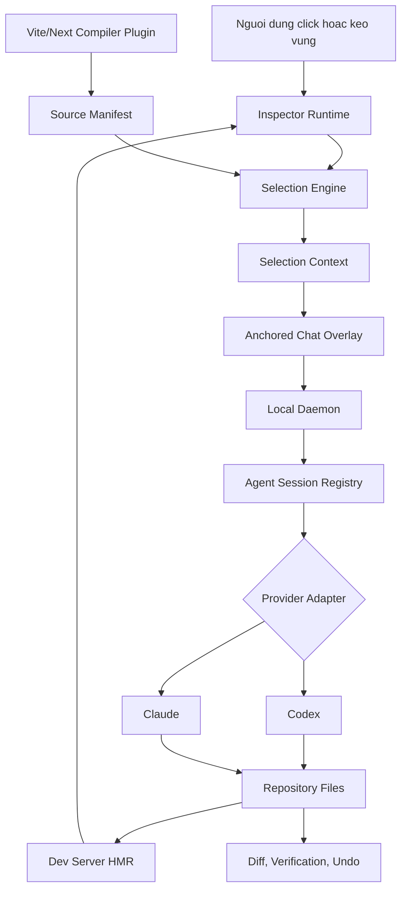
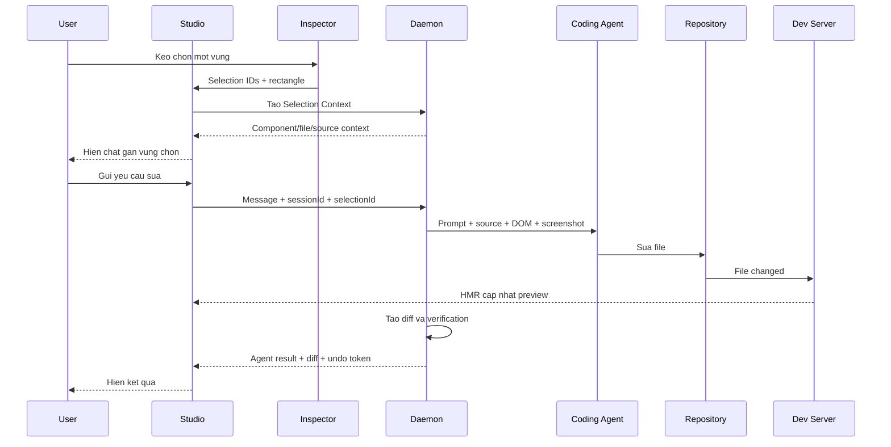

# PatchLens - Dac ta kien truc va ke hoach trien khai

> Trang thai: Ban nhap de bat dau trien khai
>
> Muc tieu: Cho phep nguoi dung chon mot vung tren giao dien web, mo chat gan voi vung do, va yeu cau Codex, Claude hoac coding agent khac tu dong sua dung component trong repository.

## 1. Tam nhin san pham

PatchLens la mot bo cong cu development cai vao du an Node.js. No cung cap mot giao dien preview co kha nang:

1. Hover, click hoac keo chuot de chon mot phan giao dien.
2. Tu dong anh xa DOM da chon ve component, file va dong code nguon.
3. Hien khung chat ngay ben duoi hoac ben canh vung da chon.
4. Gan chat voi mot phien Codex, Claude hoac coding agent dang lam viec tren repository.
5. Gui day du ngu canh cua vung chon cho agent.
6. De agent tu dong sua file trong repository.
7. Cap nhat preview qua HMR, hien diff va cho phep undo.

Gia tri cot loi khong nam o viec chup anh man hinh. Gia tri cot loi la **Visual-to-Code Grounding**: bien mot vung nhin thay tren giao dien thanh mot vi tri code co do tin cay cao.

## 2. Nguyen tac thiet ke

- **Local-first:** Studio, daemon va agent bridge chay tren may nguoi dung.
- **Provider-independent:** UI va Inspector khong phu thuoc rieng Codex hay Claude.
- **Development-only:** Ma Inspector khong duoc dua vao production build.
- **Safe automation:** Agent co the tu sua code, nhung moi request deu co diff va kha nang undo.
- **Preserve user changes:** Khong reset hoac ghi de cac thay doi nguoi dung dang lam.
- **Progressive framework support:** Bat dau voi React + Vite, sau do mo rong sang Next.js va framework khac.
- **Explicit session ownership:** PatchLens phai biet agent session nao dang xu ly du an; khong tu y chiem quyen mot cuoc chat ben ngoai.

## 3. Trai nghiem nguoi dung muc tieu

```text
npm install -D @patchlens/dev
npx patchlens init
npx patchlens connect codex
npm run patchlens
```

Sau khi Studio mo:

```text
Mo preview
  -> Bat che do Select
  -> Hover de highlight element
  -> Click de chon mot element
     hoac keo chuot de chon mot nhom element
  -> PatchLens xac dinh component/file/dong code
  -> Chat neo ben duoi vung chon
  -> Nguoi dung nhap yeu cau
  -> Agent tu sua code
  -> Dev server HMR cap nhat preview
  -> PatchLens kiem tra thay doi va hien diff
  -> Nguoi dung tiep tuc chat hoac undo
```

## 4. Kien truc tong the



## 5. Cau truc monorepo de xuat

```text
patchlens/
|-- apps/
|   |-- studio/                  # Preview, toolbar, anchored chat, diff viewer
|   `-- daemon/                  # Local server, project va agent sessions
|
|-- packages/
|   |-- cli/                     # init, dev, connect, disconnect, doctor
|   |-- dev/                     # Package duy nhat nguoi dung can cai
|   |-- inspector-runtime/       # Hover, click, drag selection
|   |-- selection-engine/        # DOM rectangle -> component candidates
|   |-- source-mapper/           # patchlensId -> file/line/component
|   |-- compiler-vite/           # AST transform cho React + Vite
|   |-- compiler-next/           # Ho tro Next.js trong giai doan sau
|   |-- anchored-chat/           # UI chat doc lap voi CSS cua website
|   |-- agent-protocol/          # Type, schema va event chung
|   |-- mcp-server/              # Bridge cho coding agent ben ngoai
|   |-- provider-codex/          # Codex session adapter
|   |-- provider-claude/         # Claude session adapter
|   |-- patch-transaction/       # Diff, checkpoint va undo
|   `-- visual-verifier/         # Screenshot truoc/sau va kiem tra preview
|
|-- examples/
|   `-- react-vite-demo/
|
|-- docs/
|   |-- protocol.md
|   |-- inspector.md
|   `-- provider-adapters.md
|
|-- package.json
|-- pnpm-workspace.yaml
`-- tsconfig.base.json
```

Nguoi dung chi cai `@patchlens/dev`. Cac package con duoc giu rieng de de test, version va mo rong framework/provider.

## 6. Cac thanh phan cot loi

### 6.1. Studio

Studio la giao dien web chay tren localhost va gom:

- Toolbar chon project, route, viewport va provider.
- Preview cua dev server nam trong iframe hoac mot browser surface duoc kiem soat.
- Inspector overlay.
- Chat neo theo vung chon.
- Trang thai agent dang suy nghi, dang sua file, dang test.
- Diff viewer va nut undo.
- Console errors va ket qua verification.

Studio khong truc tiep sua repository. Moi thao tac lien quan den file hoac agent deu di qua Local Daemon.

### 6.2. Inspector Runtime

Inspector Runtime duoc inject vao preview chi trong development mode.

Nhiem vu:

- Dung `document.elementFromPoint()` de tim element khi hover.
- Ve highlight ma khong thay doi layout cua website.
- Ho tro click de chon mot DOM element.
- Ho tro pointer drag de tao selection rectangle.
- Tim cac element giao voi rectangle bang `getBoundingClientRect()`.
- Theo doi scroll, resize va DOM mutation.
- Gui selection metadata ve Studio.

Inspector nen dung Shadow DOM hoac mot overlay root doc lap de CSS cua du an khong lam hong UI cua PatchLens.

### 6.3. Compiler Plugin va Source Manifest

Day la thanh phan giup PatchLens tu xac dinh component chinh xac.

Trong development build, compiler plugin bien doi JSX/TSX:

```tsx
<Button>Dang ky</Button>
```

thanh metadata tuong duong:

```html
<button data-patchlens-id="pl_a82f">Dang ky</button>
```

Dong thoi tao manifest local:

```json
{
  "pl_a82f": {
    "component": "PricingCTA",
    "file": "src/components/PricingCTA.tsx",
    "line": 42,
    "column": 8
  }
}
```

Yeu cau:

- ID on dinh trong mot development session.
- Khong dua duong dan tuyet doi vao DOM.
- Manifest chi duoc phuc vu tren localhost.
- Metadata phai bi loai bo khoi production build.
- Ho tro element duoc render qua wrapper component.
- Co fallback bang source map va React Fiber khi metadata truc tiep khong du.

### 6.4. Selection Engine

Selection Engine nhan mot hoac nhieu DOM node va tra ve component candidate.

Che do click:

1. Lay element duoi con tro.
2. Tim `data-patchlens-id` gan nhat.
3. Resolve qua Source Manifest.
4. Tra ve component chinh xac.

Che do keo vung:

1. Lay tat ca element co rectangle giao voi vung chon.
2. Loai bo cac element qua nho hoac bi che khuat hoan toan.
3. Resolve cac `patchlens-id`.
4. Tim component ancestor chung nho nhat.
5. Xep hang candidate theo coverage va specificity.

Ket qua nen co confidence:

```ts
type SelectionConfidence = "exact" | "likely" | "visual-only";
```

- `exact`: Co compiler metadata ro rang.
- `likely`: Suy ra tu source map, Fiber hoac component ancestor.
- `visual-only`: Chi co screenshot/DOM, agent phai tim code.

### 6.5. Anchored Chat

Chat phai xuat hien gan vung da chon nhung khong duoc lam thay doi DOM layout cua website.

De xuat:

- Render chat trong overlay layer cua Studio hoac Shadow DOM.
- Chuyen toa do iframe sang toa do Studio.
- Uu tien hien ben duoi selection.
- Neu khong du cho, chuyen sang ben tren hoac ben canh.
- Cap nhat vi tri bang `ResizeObserver` va scroll listeners.
- Mot chat thread co the giu mot hoac nhieu selection lien quan.

Moi message phai luu `selectionId` de agent biet ngu canh dang noi den phan nao.

### 6.6. Local Daemon

Daemon la tien trinh Node.js chay tren `127.0.0.1`.

Nhiem vu:

- Quan ly project root duoc phep truy cap.
- Khoi dong hoac ket noi dev server.
- Luu selection context.
- Quan ly Codex/Claude sessions.
- Stream agent events ve Studio.
- Theo doi file changes.
- Tao diff va undo transaction.
- Chay test, lint hoac verification command.

Giao tiep de xuat:

- HTTP cho cac request ngan.
- WebSocket hoac Server-Sent Events cho agent streaming.
- Session token local de ngan website khac goi daemon.

### 6.7. Agent Session Registry

PatchLens chi co the tiep tuc dung phien AI neu no biet chinh xac session do.

```ts
type AgentSession = {
  id: string;
  projectId: string;
  provider: "codex" | "claude";
  providerSessionId: string;
  status: "idle" | "running" | "waiting" | "failed";
  activeSelectionId?: string;
  createdAt: string;
};
```

Co hai che do:

#### Managed session

PatchLens khoi tao va so huu agent session. Chat trong Studio gui message truc tiep vao cung session. Day la che do de dat muc tieu tu dong hoa day du.

#### Attached session

Nguoi dung dang dung Codex/Claude o mot ung dung khac. Coding agent duoc cai MCP/skill de goi PatchLens va lay active selection.

Khong nen hua rang mot trang web co the tu dong chiem quyen moi cuoc chat Codex/Claude dang mo. Viec gui message vao session ben ngoai chi duoc lam khi provider co bridge duoc ho tro va nguoi dung da cap quyen.

### 6.8. Provider Adapter

Studio va Daemon chi giao tiep qua mot interface chung:

```ts
export interface CodingProvider {
  id: "codex" | "claude" | string;

  detect(): Promise<ProviderStatus>;

  createSession(input: CreateSessionInput): Promise<AgentSessionHandle>;

  sendMessage(
    session: AgentSessionHandle,
    message: AgentRequest
  ): AsyncIterable<AgentEvent>;

  cancel(session: AgentSessionHandle): Promise<void>;

  dispose(session: AgentSessionHandle): Promise<void>;
}
```

Adapter khong duoc dua thong tin provider-specific vao Inspector hoac Studio protocol.

### 6.9. MCP Server

MCP la bridge de Codex, Claude hoac agent ben ngoai truy cap selection hien tai.

Tool de xuat:

```text
patchlens.get_active_selection
patchlens.get_selection_context
patchlens.get_source_context
patchlens.capture_preview
patchlens.get_console_errors
patchlens.verify_visual_change
```

Agent co the nhan prompt nhu:

```text
Sua vung giao dien toi dang chon: lam nut chinh noi bat hon.
```

Sau do agent goi `patchlens.get_active_selection` de lay dung component thay vi doan tu mo ta.

### 6.10. Patch Transaction va Undo

Tu dong sua code phai di kem kha nang khoi phuc an toan.

Moi request tao mot transaction:

```ts
type PatchTransaction = {
  id: string;
  sessionId: string;
  selectionId: string;
  instruction: string;
  filesBefore: FileSnapshot[];
  filesAfter: FileSnapshot[];
  diff: string;
  status: "running" | "applied" | "reverted" | "failed";
};
```

Yeu cau an toan:

- Chi undo cac thay doi thuoc transaction cua agent.
- Khong dung `git reset --hard`.
- Khong ghi de thay doi nguoi dung tao sau khi transaction bat dau.
- Canh bao neu agent mo rong pham vi ra ngoai component/file du kien.

## 7. Data contract chinh

### 7.1. Source location

```ts
export type SourceLocation = {
  id: string;
  framework: "react" | "next" | "unknown";
  componentName?: string;
  file: string;
  line: number;
  column: number;
};
```

### 7.2. Visual selection

```ts
export type VisualSelection = {
  id: string;
  projectId: string;
  route: string;
  viewport: {
    width: number;
    height: number;
    deviceScaleFactor: number;
  };
  rectangle: {
    x: number;
    y: number;
    width: number;
    height: number;
  };
  elementIds: string[];
  sourceCandidates: Array<{
    location: SourceLocation;
    confidence: number;
  }>;
  confidence: SelectionConfidence;
};
```

### 7.3. Selection context

```ts
export type SelectionContext = {
  selection: VisualSelection;
  screenshotPath?: string;
  sanitizedHtml: string;
  computedStyles: Record<string, string>;
  accessibilitySummary?: string;
  relatedSourceFiles: Array<{
    path: string;
    startLine: number;
    endLine: number;
  }>;
  consoleErrors: string[];
};
```

### 7.4. Agent request

```ts
export type AgentRequest = {
  sessionId: string;
  selectionId: string;
  instruction: string;
  context: SelectionContext;
  scopePolicy: "prefer-selection" | "strict" | "allow-related";
  verification: {
    route: string;
    captureAfterChange: boolean;
  };
};
```

`prefer-selection` nen la mac dinh. `strict` co the lam agent khong sua duoc CSS dung chung hoac parent component can thiet.

## 8. Vong doi cua mot yeu cau



## 9. Cau truc prompt gui agent

Prompt nen duoc tao co cau truc, khong chi ghep mot doan text dai.

```text
Project root: <project-root>
Route: /pricing

User request:
"Doi nut nay sang mau cam va lam no nho hon."

Selected component:
- Name: PricingCTA
- File: src/components/PricingCTA.tsx
- Line: 42
- Confidence: exact

Visual context:
- Rectangle: x, y, width, height
- Screenshot: <local-reference>
- DOM: <sanitized-dom>
- Computed styles: <selected-styles>

Scope policy:
- Uu tien chi sua selected component va style lien quan.
- Neu can sua file dung chung, bao cao scope expansion.
- Khong thay doi phan khong lien quan.

Verification:
- Mo lai route /pricing.
- Xac nhan component van render.
- Bao cao file da thay doi va test da chay.
```

## 10. Bao mat va rieng tu

- Daemon chi bind vao `127.0.0.1` theo mac dinh.
- Moi Studio session co local authentication token.
- Project root phai duoc nguoi dung chon hoac phe duyet.
- Loai bo password, token va gia tri input nhay cam khoi DOM capture.
- Khong gui toan bo trang neu selection context da du.
- Hien ro provider nao se nhan screenshot va source code.
- Khong luu API key trong `.patchlens/config.json`.
- Dung credential/session do Codex hoac Claude tu quan ly khi co the.
- Log phai redact duong dan va secret neu duoc export.

## 11. Stack ky thuat de xuat

Day la lua chon ban dau, co the thay doi sau spike:

- Ngon ngu: TypeScript.
- Package manager: pnpm workspaces.
- Studio: React + Vite.
- Daemon: Node.js voi mot HTTP framework nhe.
- Streaming: WebSocket hoac Server-Sent Events.
- Schema validation: Zod hoac JSON Schema.
- Inspector: Vanilla TypeScript de giam dependency tren app nguoi dung.
- Build instrumentation: Babel/SWC/Vite transform tuy framework.
- Test: Vitest cho package, Playwright cho end-to-end visual flow.
- Session storage MVP: in-memory + file state local.
- Session storage ve sau: SQLite neu can resume va history ben vung.

## 12. Ke hoach trien khai

### Phase 0 - Scaffold

- Tao pnpm monorepo.
- Cau hinh TypeScript, lint, format va test.
- Tao `react-vite-demo`.
- Dinh nghia `agent-protocol` va schema co ban.

### Phase 1 - Inspector va source mapping

- Tao Vite plugin inject `data-patchlens-id`.
- Tao Source Manifest.
- Hover highlight.
- Click selection.
- Drag rectangle selection.
- Selection confidence va component candidates.

Ket qua can dat:

```text
Nguoi dung click/drag tren demo
-> UI hien dung component name
-> UI hien dung file va dong code
```

### Phase 2 - Studio va anchored chat

- Tao Studio shell.
- Embed preview.
- Chuyen toa do selection tu iframe sang Studio.
- Hien chat gan vung chon.
- Luu selection thread.
- Tao mock agent de test streaming.

### Phase 3 - Daemon va Codex managed session

- Tao local daemon.
- Project permission va session token.
- Provider interface.
- Codex adapter spike.
- Stream message va agent events.
- Theo doi file change va HMR.
- Tao diff va undo transaction.

Luu y: Truoc khi code adapter, can xac minh be mat tich hop Codex chinh thuc duoc ho tro trong moi truong muc tieu. Khong hard-code vao mot CLI output khong on dinh.

### Phase 4 - MCP attached session

- Tao MCP server.
- Expose active selection tools.
- Tao installer `patchlens connect codex`.
- Tao skill/plugin huong dan Codex su dung selection context.
- Them `patchlens doctor` va `patchlens disconnect`.

### Phase 5 - Claude va Next.js

- Claude provider adapter.
- Claude MCP installer.
- Next.js compiler integration.
- Ho tro route va server/client component boundaries.

### Phase 6 - Visual verification

- Chup selected region truoc/sau.
- Kiem tra component con ton tai sau HMR.
- Phat hien runtime/console error moi.
- Hien before/after va diff trong Studio.

## 13. Tieu chi hoan thanh MVP

MVP duoc xem la dat khi:

- Cai duoc vao mot React + Vite repo bang mot command flow ro rang.
- `npm run patchlens` mo Studio va preview.
- Click chon element tra ve dung file/dong code trong phan lon demo cases.
- Keo vung tra ve component candidate hop ly.
- Chat hien gan selection va giu dung selection thread.
- Codex managed session nhan duoc source context.
- Agent tu sua file va preview cap nhat qua HMR.
- Studio hien cac file da thay doi.
- Undo chi hoan tac thay doi cua agent.
- Khong co PatchLens runtime trong production build.

## 14. Rui ro ky thuat chinh

### DOM khong tuong ung 1-1 voi component

Mot component co the render Fragment, Portal, wrapper hoac nhieu DOM root. Can compiler metadata ket hop React Fiber/source map fallback.

### CSS den tu noi khac

Style co the nam trong global CSS, Tailwind config, theme token hoac parent component. Vi vay scope mac dinh nen la `prefer-selection`, khong phai khoa tuyet doi mot file.

### External AI session

Khong phai provider nao cung cho phep mot website gui message vao cuoc chat dang mo. Managed session la con duong chinh; MCP attached mode la con duong phu.

### Cross-origin preview

Iframe khac origin khong cho Inspector doc DOM. MVP chi nen ho tro local dev server duoc inject. Website ben ngoai can browser extension hoac reverse proxy o giai doan sau.

### Bao ve thay doi nguoi dung

Repository co the dang dirty. Patch transaction phai ghi nhan baseline va tranh ghi de thay doi phat sinh dong thoi.

## 15. Cac cau hoi can spike

- Vite transform nao cho source metadata on dinh nhat: Babel, SWC hay plugin AST rieng?
- Cach map function component va DOM root khi component tra ve Fragment?
- Codex managed session co the duoc khoi tao, tiep tuc va stream bang be mat chinh thuc nao?
- Claude managed session se dung CLI bridge hay API adapter?
- Chat nen render o parent Studio hay trong iframe Shadow DOM?
- Undo nen dung file snapshot, reverse patch hay temporary worktree?
- Muc du lieu computed styles toi thieu nao la du cho agent?

## 16. Cong viec tiep theo de bat dau code

1. Khoi tao Git va pnpm workspace.
2. Tao `apps/studio`, `apps/daemon` va `examples/react-vite-demo`.
3. Dinh nghia protocol types trong `packages/agent-protocol`.
4. Lam spike Vite plugin inject `data-patchlens-id`.
5. Tao hover/click inspector proof of concept.
6. Them drag rectangle va component candidate resolver.
7. Tao anchored chat voi mock agent.
8. Sau khi luong visual-to-code on dinh moi bat dau Codex adapter.

