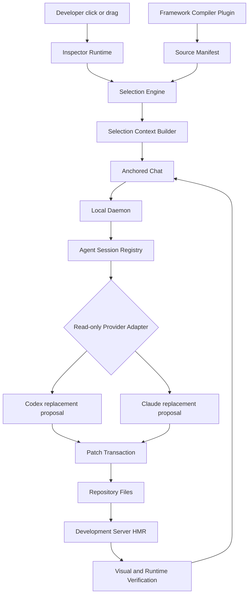
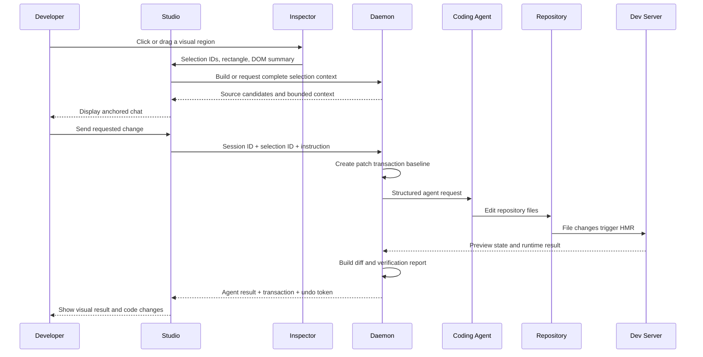

# PatchLens AI - Technical architecture and implementation plan

> Status: active source implementation
>
> Objective: let a developer select a visible region in a live web preview, attach a conversation to that selection, and allow Codex, Claude, or another coding agent to edit the corresponding source code safely.

## Implementation checkpoint - 2026-08-10

The current repository has completed the first safe end-to-end source slice:

- React/Vite source instrumentation and a local source manifest.
- Hover, click, and rectangle-drag selection with responsive viewport tracking.
- Selection-anchored conversation UI for Desktop, Tablet, and Mobile previews.
- Custom viewport width and height controls with responsive selection rebinding.
- Bounded context capture for sanitized DOM, computed styles, accessibility, and runtime errors.
- Provider-independent mock, Codex CLI, and Claude Code CLI adapters.
- Read-only provider execution that returns exact replacement proposals instead of writing files directly.
- Atomic multi-file transactions with related-file scope approval, configured-root confinement, symlink target checks, content hashes, compensating rollback, persistent history, restart recovery, unified diffs, and safe undo.
- Studio transaction history, related-file scope approval, request cancellation, diff review, and conflict reporting.
- Active selection synchronization to the daemon.
- A read-only MCP stdio bridge exposing the current selection and transaction history.
- Loopback binding, explicit browser-origin restrictions, and browser/bearer authentication.
- A `patchlens start` launcher that can run the preview, daemon, and production Studio shell together.
- Runtime protocol guards that reject malformed messages from an untrusted preview frame.

Thirty-one direct Node runtime tests pass for protocol validation, CLI behavior, provider parsing and prompt safety, MCP requests, transaction input validation, multi-file apply, persistence, restart loading, undo, and concurrent-edit conflicts. Full workspace typecheck, Vite builds, and browser/HMR testing remain blocked until dependencies can be installed.

## 1. Product objective

PatchLens AI is a development tool installed into an existing Node.js web project. It should provide a live preview where a developer can:

1. Switch between desktop, tablet, mobile, or a custom responsive viewport.
2. Hover, click, or drag to select part of the interface.
3. Resolve the selected DOM region to component and source candidates.
4. Open a chat beside the selected region.
5. Attach the chat to a managed or external coding-agent session.
6. Send structured visual, source, and responsive context to the agent.
7. Allow the agent to edit repository files.
8. Refresh through the existing development server and HMR.
9. Show changed files, verification results, and transaction-scoped undo.

The core technical problem is **visual-to-code grounding**. PatchLens must translate a visible selection into reliable source context instead of asking the agent to infer everything from a screenshot or natural-language description.

## 2. Product boundaries

### In scope

- Local development repositories.
- React + Vite as the first supported environment.
- Development-time JSX and TSX instrumentation.
- Click and rectangle-drag selection.
- Desktop, tablet, and mobile responsive preview modes.
- Custom viewport width and height controls.
- Responsive viewport metadata included in agent context.
- Component, file, line, and column candidates.
- Chat attached to a selection.
- Local agent session orchestration.
- Codex as the first managed provider.
- MCP access for explicitly configured external agents.
- File transactions, diff review, verification, and safe undo.

### Not in the first release

- Arbitrary production websites.
- Cross-origin DOM inspection without an extension or proxy.
- Automatic control of any unrelated Codex or Claude conversation.
- Every frontend framework at launch.
- A proprietary website builder or hosted replacement for the user's repository.
- Silent editing without visible transaction state.

## 3. Design principles

- **Local-first:** Studio, daemon, source manifest, and agent bridges run on the developer's machine.
- **Provider-independent:** Inspector and Studio use a shared protocol rather than provider-specific logic.
- **Development-only instrumentation:** source identifiers must not enter production output.
- **Structured context:** send bounded, inspectable data instead of an unstructured prompt dump.
- **Safe automation:** every autonomous edit belongs to a recoverable transaction.
- **Preserve developer work:** unrelated uncommitted changes must remain intact.
- **Explicit permissions:** project roots, providers, screenshots, and external bridges require clear authorization.
- **Measured confidence:** ambiguous selections must be reported as ambiguous.
- **Progressive support:** stabilize one framework and provider before expanding.
- **Defensible workflow:** differentiate through grounding, transactions, verification, and provider portability rather than visual selection alone.

## 4. Target developer experience

```bash
npm install --save-dev @patchlens-ai/dev
npx patchlens init
npx patchlens connect codex
npm run patchlens
```

Target interaction:

```text
Open PatchLens Studio
  → load the project's development preview
  → choose Desktop, Tablet, Mobile, or a custom viewport
  → enable selection mode
  → hover to inspect an element
  → click one element or drag across a region
  → resolve source candidates
  → show chat beside the selection
  → send the request to the active agent session
  → capture agent-owned file changes
  → wait for HMR
  → verify the selected region
  → show diff, result, and undo
```

## 5. System architecture



## 6. Proposed monorepo structure

```text
patchlens-ai/
├── apps/
│   ├── studio/                  # Live preview, selection UI, chat, review
│   └── daemon/                  # Project permissions, sessions, file transactions
│
├── packages/
│   ├── agent-protocol/          # Provider-independent contracts
│   ├── cli/                     # init, doctor, and MCP stdio entry point
│   ├── coding-provider/         # Mock, Codex CLI, and Claude CLI adapters
│   ├── dev/                     # Public development dependency
│   ├── inspector-runtime/       # Hover, click, drag, overlay
│   ├── compiler-vite/           # React/Vite instrumentation
│   ├── compiler-next/           # Planned Next.js instrumentation
│   ├── selection-engine/        # Candidate ranking and confidence
│   ├── source-mapper/           # Identifier and source-map resolution
│   ├── context-builder/         # DOM, styles, screenshot, a11y, errors
│   ├── mcp-server/              # Read-only external-agent context bridge
│   ├── patch-transaction/       # Baselines, diffs, conflict detection, undo
│   └── visual-verifier/         # HMR, screenshots, runtime checks
│
├── examples/
│   └── react-vite-demo/
│
└── docs/
```

The developer should install one public package. Internal packages remain separate to keep framework and provider concerns isolated.

## 7. Component responsibilities

### 7.1. Studio

Studio is the local web interface.

Responsibilities:

- Display the project's development preview.
- Switch among named responsive presets without restarting the preview.
- Rotate tablet and mobile responsive widths.
- Control Inspector mode.
- Receive selection messages from the preview.
- Display selection confidence and source candidates.
- Position chat near the selected rectangle.
- Display agent session state and streamed events.
- Show changed files, source diff, visual result, and undo state.
- Make every provider-bound context payload inspectable.

Studio must not read or modify repository files directly. File and agent operations go through the daemon.

#### Responsive preview contract

The responsive preview is part of the grounding contract, not only a visual convenience.

- Desktop uses the available Studio width.
- Tablet starts at `768 px` and can rotate to a `1024 px` responsive width.
- Mobile starts at `390 px` and can rotate to an `844 px` responsive width.
- The iframe emits a resize event whenever its responsive width changes.
- The Inspector recalculates the active rectangle and current viewport dimensions.
- Studio clamps anchored chat to the resized preview boundary.
- Agent requests include the named preset, orientation, actual width, actual height, and device scale factor.
- The active `selectionId` and chat thread remain stable across viewport changes.

The initial implementation models responsive CSS widths. Later device emulation may add custom dimensions, zoom, touch/hover capability, safe-area insets, user-agent profiles, and side-by-side breakpoint comparison. Those capabilities must not falsify the actual dimensions sent to an agent.

### 7.2. Inspector Runtime

The Inspector is injected only into the local development preview.

Responsibilities:

- Use `document.elementsFromPoint()` to inspect visible nodes.
- Draw hover and selection overlays without changing layout.
- Intercept click selection while selection mode is active.
- Create a rectangle from pointer drag.
- Find instrumented nodes intersecting the rectangle.
- Track selected-element movement during scroll and resize.
- Send selection data to Studio through an explicit message protocol.
- Remove sensitive DOM values before context capture.

The overlay should use Shadow DOM or an isolated root so application styles cannot corrupt PatchLens controls.

### 7.3. Compiler plugin

The compiler plugin creates the preferred exact mapping path.

Source:

```tsx
<button className="primary-action">Start planning</button>
```

Development instrumentation:

```html
<button data-patchlens-id="pl_a82f" class="primary-action">
  Start planning
</button>
```

Local manifest:

```json
{
  "pl_a82f": {
    "framework": "react",
    "componentName": "Hero",
    "file": "src/components/Hero.tsx",
    "line": 22,
    "column": 11,
    "tagName": "button"
  }
}
```

Requirements:

- Run only in the development server.
- Avoid absolute paths in DOM and HTTP responses.
- Preserve source lines where practical.
- Replace stale manifest entries during HMR.
- Avoid duplicate identifiers when another PatchLens transform already ran.
- Exclude dependencies and generated files.
- Provide a migration path to source-map and framework-specific fallbacks.

### 7.4. Selection Engine

The Selection Engine converts one or more DOM nodes into ranked source candidates.

Click algorithm:

1. Get elements at pointer coordinates.
2. Ignore PatchLens overlay nodes.
3. Resolve the nearest instrumented ancestor.
4. Load its manifest entry.
5. Return the exact rectangle, DOM summary, and source candidate.

Drag algorithm:

1. Build a normalized rectangle from pointer start and end.
2. Collect visible instrumented nodes intersecting the rectangle.
3. Calculate element coverage and selection coverage.
4. Remove hidden, zero-size, and duplicate candidates.
5. Prefer a useful shared component boundary over a tiny child node.
6. Return the highest-ranked candidate and a bounded alternative list.

Confidence levels:

```ts
type SelectionConfidence = "exact" | "likely" | "visual-only";
```

The engine should eventually include an explanation for every score so mapping failures are debuggable.

### 7.5. Selection Context Builder

The context builder combines visual and source information into a bounded provider payload.

Potential inputs:

- Visual selection and confidence.
- Sanitized selected DOM.
- Selected-region screenshot.
- Computed styles relevant to layout, typography, color, and state.
- Accessibility name, role, and state.
- Current route and viewport.
- Named viewport preset and orientation when Studio controls the preview.
- Source candidates and surrounding source excerpts.
- Related imported components or style files.
- Existing console and runtime errors.

Context rules:

- Limit DOM depth and total payload size.
- Remove secret-like attributes and form values.
- Do not send the entire repository automatically.
- Show the final payload to the developer.
- Identify which fields leave the local machine.

### 7.6. Anchored Chat

Chat is visually attached to a selection while remaining isolated from application layout and styles.

Positioning rules:

- Prefer below the selected rectangle.
- Move above or beside it when space is insufficient.
- Clamp the panel to the preview boundary.
- Reposition on scroll, resize, HMR, and responsive changes.
- Preserve the same thread when the selected element moves.
- Allow explicit reselection without silently changing thread scope.

Every message stores a `selectionId`. A thread may later support multiple explicitly attached selections.

### 7.7. Local Daemon

The daemon runs on the local machine and binds to `127.0.0.1` by default.

Responsibilities:

- Manage approved project roots.
- Read PatchLens project configuration.
- Detect or launch the development server.
- Store selection contexts.
- Manage provider sessions.
- Stream provider events to Studio.
- Track file changes and patch transactions.
- Run configured verification commands.
- Coordinate HMR and visual verification.
- Persist recoverable local state.

Suggested communication:

- HTTP for health, configuration, and short requests.
- Server-Sent Events or WebSocket for provider streaming.
- Short-lived browser session cookie for Studio authentication.
- Bearer-token channel for MCP and CLI clients.

### 7.8. Agent Session Registry

PatchLens must know which project, provider, selection, and provider session belong together.

```ts
type AgentSession = {
  id: string;
  projectId: string;
  provider: "mock" | "codex" | "claude" | string;
  providerSessionId?: string;
  status: "idle" | "running" | "waiting" | "failed";
  activeSelectionId?: string;
  createdAt: string;
};
```

Managed sessions are owned by PatchLens. Attached sessions are owned by an external agent and communicate through an explicitly installed bridge.

PatchLens must not claim it can automatically control an arbitrary external conversation without a supported provider capability and user authorization.

### 7.9. Provider Adapter

Studio and daemon should depend on one provider-independent interface.

```ts
export interface CodingProvider {
  readonly id: string;
  readonly label: string;
  probe(): Promise<ProviderAvailability>;
  run(input: CodingProviderRequest): Promise<CodingProviderResult>;
}

The current source implementation uses this bounded request/response contract. Native session creation, event streaming, and provider-specific resume can be layered on later without changing the visual selection protocol.
```

Provider adapters own:

- Availability detection.
- Authentication-state reporting.
- Session creation and continuation.
- Provider-specific event translation.
- Cancellation and cleanup.
- Provider error normalization.

Provider-specific fields must not leak into the selection protocol.

### 7.10. MCP Server

MCP enables explicitly configured external coding agents to retrieve PatchLens context.

Initial tool surface:

```text
patchlens_get_active_selection
patchlens_get_source_context
patchlens_get_console_errors
patchlens_list_transactions
```

The current bridge also exposes `patchlens://selection/current` and `patchlens://transactions` as read-only resources. Screenshot capture and visual-verification tools remain future capabilities.

Requirements:

- Authenticate with the daemon using the local bearer token.
- Restrict all source access to the approved project root.
- Keep tool responses bounded.
- Avoid embedding secrets in configuration.
- Install and remove configuration without overwriting unrelated user settings.

### 7.11. Patch Transaction

Automatic editing requires a transaction boundary.

```ts
type PatchTransaction = {
  id: string;
  sessionId: string;
  selectionId: string;
  instruction: string;
  files: PatchFileChange[];
  scopeExpansion: string[];
  status: "running" | "applied" | "reverted" | "conflicted" | "failed";
  undoAvailable: boolean;
  createdAt: string;
  updatedAt: string;
};
```

The current source prototype implements a deterministic single-file vertical slice:

1. Studio sends `text: New visible text` with the active selection.
2. Daemon requires an exact project-relative source file and a direct-text candidate.
3. `packages/patch-transaction` resolves the real path and rejects lexical or symlink escapes.
4. The manager captures a SHA-256 baseline and requires one unambiguous text occurrence.
5. The source file is written and verified against the expected after hash.
6. Studio receives the transaction and displays its unified diff.
7. Undo succeeds only if the current file still matches the transaction after hash.
8. A newer developer edit changes the hash, marks the transaction conflicted, and prevents overwrite.

This slice intentionally limits replacement text to one plain JSX-text line. It proves transaction ownership and undo safety without pretending the mock provider understands general natural language.

Safety requirements:

- Capture the baseline before the provider begins editing.
- Detect changes made concurrently by the developer.
- Associate only agent-owned changes with undo.
- Do not use destructive whole-worktree reset operations.
- Report edits outside expected source candidates.
- Prevent writes outside the approved root.
- Preserve diagnostic information for interrupted transactions.

### 7.12. Visual Verifier

Verification should answer:

- Did the development server remain available?
- Did HMR complete?
- Does the selected component still exist?
- Were new runtime or console errors introduced?
- What changed visually inside the selected region?
- Which configured tests or checks passed?

Verification output belongs to the same transaction and conversation thread.

## 8. Core data contracts

### Source location

```ts
export type SourceLocation = {
  id: string;
  framework: "react" | "next" | "unknown";
  componentName?: string;
  file: string;
  line: number;
  column: number;
  tagName?: string;
};
```

### Visual selection

```ts
export type VisualSelection = {
  id: string;
  route: string;
  viewport: Viewport;
  rectangle: Rectangle;
  elements: SelectedElement[];
  primaryElement: SelectedElement;
  confidence: SelectionConfidence;
  createdAt: string;
};
```

The viewport carried by `VisualSelection` is:

```ts
export type Viewport = {
  width: number;
  height: number;
  deviceScaleFactor: number;
  preset?: "desktop" | "tablet" | "mobile" | "custom";
  orientation?: "portrait" | "landscape";
};
```

Width and height are authoritative. Preset and orientation are descriptive context added by Studio and must not replace the measured iframe dimensions.

### Selection context

```ts
export type SelectionContext = {
  selection: VisualSelection;
  sanitizedHtml: string;
  computedStyles: Record<string, string>;
  accessibilitySummary?: string;
  screenshotReference?: string;
  relatedSourceFiles: SourceExcerpt[];
  consoleErrors: string[];
};
```

### Agent request

```ts
export type AgentRequest = {
  sessionId?: string;
  provider: string;
  instruction: string;
  selection: VisualSelection;
  context: SelectionContext;
  scopePolicy: "prefer-selection" | "strict" | "allow-related";
  verification: {
    route: string;
    captureAfterChange: boolean;
    commands: string[];
  };
};
```

## 9. Request lifecycle



## 10. Agent prompt construction

Provider adapters should receive structured fields. If a text prompt must be generated, it should preserve clear sections.

```text
Project
- Approved root: <project-root>
- Route: /pricing
- Viewport: 1440 x 900

Developer request
"Make the primary CTA warmer and reduce its horizontal padding."

Selected source
- Component: HeroCTA
- File: src/components/HeroCTA.tsx
- Line: 42
- Confidence: exact

Visual context
- Rectangle: x, y, width, height
- Screenshot: <local reference>
- DOM: <sanitized subtree>
- Computed styles: <bounded style set>

Scope policy
- Prefer the selected component and directly related styles.
- Report meaningful scope expansion before changing shared files.
- Do not modify unrelated page regions.

Verification
- Reload /pricing.
- Confirm the selected component renders.
- Report new console errors.
- Report changed files and commands executed.
```

## 11. Security and privacy

- Bind the daemon to `127.0.0.1` by default.
- Use a short-lived browser session cookie for Studio and a local bearer token for MCP/CLI clients.
- Treat the launcher/configuration root as the enforced boundary in the current prototype.
- Require an explicit first-run project-root review and approval flow before public release.
- Reject resolved paths outside the approved root.
- Remove secret-like DOM attributes and form values.
- Limit screenshot capture to requested regions whenever possible.
- Show which provider receives source or visual context.
- Keep provider credentials under provider control when possible.
- Never store API keys in `.patchlens/config.json`.
- Redact secrets and private paths from exported diagnostics.
- Make telemetry opt-in and privacy-preserving.

## 12. Proposed technical stack

- Language: TypeScript.
- Package manager: pnpm workspaces.
- Studio: React + Vite.
- Daemon: Node.js with a minimal HTTP layer.
- Streaming: Server-Sent Events or WebSocket.
- Schema validation: Zod or JSON Schema.
- Inspector: dependency-light browser TypeScript.
- Instrumentation: TypeScript AST for the first Vite prototype, with later Babel/SWC evaluation.
- Unit tests: Vitest or Node test runner where practical.
- Browser tests: Playwright.
- Initial local state: memory plus explicit files.
- Durable session state: SQLite when resume and history are required.

## 13. Testing strategy

### Unit tests

- Identifier generation.
- Source manifest replacement during HMR.
- Rectangle intersection and ranking.
- DOM sanitization.
- Context payload limits.
- Path authorization.
- Transaction diff and undo logic.
- Provider event normalization.

### Integration tests

- Vite plugin plus React fixture.
- Studio-to-iframe messaging.
- Selection-context creation.
- Daemon session continuation.
- Provider adapter with a deterministic mock.
- Patch transaction in a dirty repository fixture.

### End-to-end tests

- Start Studio, daemon, and demo.
- Click and drag selections.
- Send contextual chat messages.
- Apply a deterministic mock file edit.
- Wait for HMR.
- Verify changed UI and diff.
- Undo the transaction.
- Repeat at desktop and mobile widths.
- Rotate tablet and mobile modes while a selection is active and confirm the same thread receives updated viewport metadata.
- Verify the requested breakpoint first, then optionally capture regression results for the other presets.

## 14. Delivery sequence

The complete ordered plan lives in [`docs/NEXT_STEPS.md`](./docs/NEXT_STEPS.md).

Recommended high-level order:

```text
Verify current prototype
  → strengthen source resolution
  → complete context capture
  → implement patch transactions
  → integrate Codex managed sessions
  → add live visual verification
  → add Codex MCP attached mode
  → add Claude and Next.js
  → add external-page support and publish packages
```

Patch transactions must be complete before autonomous provider editing. Codex should stabilize before adding a second managed provider.

## 15. Definition of the first usable MVP

The first usable MVP is complete when:

- A React + Vite repository can install PatchLens through a documented command flow.
- Studio displays a live local preview.
- Studio can target desktop, tablet, and mobile responsive widths without losing the active selection.
- Studio can target a custom width and height while preserving the active selection.
- Click and drag selections produce useful source candidates.
- The selection thread keeps its visual context across follow-up messages.
- Codex receives structured visual and source context.
- Codex edits the intended project inside an approved root.
- Every request creates a reviewable patch transaction.
- HMR updates the preview after the edit.
- PatchLens reports runtime failures and changed files.
- Undo restores only agent-owned changes.
- Production builds contain no PatchLens instrumentation.

The source-level prototype now covers the local mock and read-only CLI proposal paths. The MVP is not release-ready until dependencies can be installed, strict typecheck/build passes, and a browser run verifies selection, HMR, diff, verification, and undo.

## 16. Main technical risks

### DOM and component boundaries do not match

React components may render fragments, portals, wrappers, shared primitives, or several roots. PatchLens must combine compiler metadata with ranked fallbacks and must expose uncertainty.

### Styling may live outside the selected file

The visual result may depend on global CSS, design tokens, shared components, or parent layout. A strict single-file scope can prevent correct fixes, so scope expansion must be visible and controlled.

### External sessions may not be controllable

Provider capabilities differ. Managed sessions are the primary path. Attached mode requires an explicit supported bridge such as MCP.

### Cross-origin previews block DOM inspection

The first release should support injected local development previews. External pages require an extension or controlled proxy with explicit permissions.

### Developer changes may race with agent changes

Patch transactions must detect concurrent edits and avoid overwriting work created after the transaction baseline.

### Context can become too large

DOM, styles, screenshots, and source excerpts need strict limits and prioritization so provider requests remain fast, safe, and understandable.

## 17. Open research questions

- Should long-term React instrumentation use TypeScript AST, Babel, or SWC?
- How should component boundaries be represented for fragments and multiple roots?
- Which official Codex surface supports managed session creation and continuation?
- Which agent events can be normalized reliably across Codex and Claude?
- Should anchored chat live in the Studio parent layer or preview Shadow DOM?
- Which computed-style subset provides the best value-to-payload ratio?
- Should transaction state use file snapshots, reverse patches, or a hybrid?
- What confidence threshold should trigger user candidate selection?
- How should selection identity survive large HMR-driven DOM replacement?
- How should selection identity survive responsive conditional rendering that replaces the selected DOM subtree?
- Should advanced device emulation use iframe sizing, browser automation contexts, or a hybrid?
- How should side-by-side breakpoint comparison share one intent without creating conflicting agent threads?

## 18. Immediate engineering tasks

1. Install dependencies in a network-enabled environment.
2. Run strict typecheck and production builds across all workspace packages.
3. Start the preview, daemon, and Studio through `patchlens start`.
4. Verify Desktop, Tablet, Mobile, Custom, rotation, and anchored-chat behavior in the first browser run.
5. Fix any source-manifest, iframe-selection, or responsive synchronization issues found during verification.
6. Add browser fixtures for Vite instrumentation, selection ranking, HMR, and undo.
7. Verify Codex and Claude CLI argument templates against supported installed versions.
8. Add native provider streaming/resume only after the CLI compatibility matrix is known.
9. Implement safe provider configuration installers with backup, merge, and uninstall tests.
10. Add screenshot capture and before/after visual verification.
