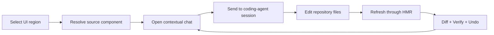
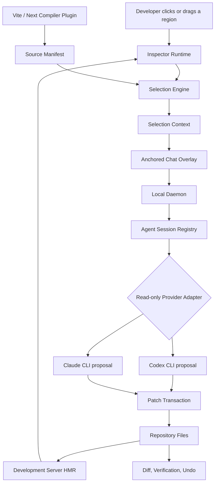

<div align="center">

# 🎯 PatchLens AI

### Select the interface. Tell the agent. Ship the patch.

**A visual context layer for AI coding agents.**

PatchLens AI lets developers select an element or region inside a live web preview, open a conversation at that exact location, and ask Codex, Claude, or another coding agent to edit the corresponding source code.


</div>

---

## Why PatchLens AI exists

AI coding tools are already capable of writing frontend code. The difficult part is often giving them the correct visual target.

A developer may say:

> Make this button warmer, reduce the spacing above it, and leave the rest of the page unchanged.

The agent still has to determine:

- Which visible button does "this button" refer to?
- Which component renders it?
- Which file and source location own that component?
- Does its styling come from local CSS, a design token, a shared component, or a parent layout?
- Is the agent allowed to update related files outside the selected component?
- How can the developer verify that the requested visual change happened without causing a regression?

PatchLens AI is designed to close the gap between **what the developer is looking at** and **what the coding agent needs to edit**.

```text
Visible interface
      ↓
Click or drag to select a region
      ↓
Resolve component + file + source location
      ↓
Open a chat attached to that selection
      ↓
Send visual and source context to the coding agent
      ↓
Let the agent edit the repository
      ↓
Reload through HMR, verify the result, show the diff, and support undo
```

## Product vision

PatchLens AI should feel like a development dependency rather than a separate website builder.

The target installation experience is:

```bash
npm install --save-dev @patchlens-ai/dev
npx patchlens init
npx patchlens start
```

> [!IMPORTANT]
> The package is not published yet. The monorepo workflow below is the verified development path; the same `init` and `start` flow is being prepared for the first public package release.

Once PatchLens Studio is running, the intended workflow is:

1. Open the application inside a live development preview.
2. Choose Desktop, Tablet, Mobile, or enter a custom width and height; rotate Tablet/Mobile when needed.
3. Enable selection mode.
4. Hover to inspect the DOM element and source component under the pointer.
5. Click a single element or drag across a group of elements.
6. Let PatchLens resolve the selection to component, file, line, and related context.
7. Display a chat directly below or beside the selected region.
8. Send the request and active responsive viewport to the coding-agent session.
9. Allow the agent to edit the repository automatically.
10. Refresh the preview through the existing development server and HMR.
11. Show the changed files, verification status, and a safe undo action.
12. Continue the conversation without losing the original visual selection.

## Core interaction loop



The selection is not merely an attachment to the first message. It remains part of the conversation thread so follow-up requests can continue to target the same component.

## Responsive preview workflow

Frontend intent is often breakpoint-specific. "Fix this card" can mean one change on desktop and a different change on mobile, so the active viewport must be part of the selection context rather than an unrelated browser setting.

The current Studio prototype provides:

| Mode | Portrait/default width | Rotated width | Intended use |
| --- | ---: | ---: | --- |
| Desktop | Fluid | — | Work with the available web workspace width. |
| Tablet | `768 px` | `1024 px` | Inspect tablet breakpoints in portrait and landscape-style widths. |
| Mobile | `390 px` | `844 px` | Inspect phone layouts in portrait and landscape-style widths. |
| Custom | User-defined | User-defined | Reproduce a specific browser, screenshot, or breakpoint size. |

When the preview width changes, the Inspector republishes the selected element rectangle and current iframe dimensions. Studio then repositions the anchored chat and sends the responsive preset, orientation, width, height, and device scale factor with the agent request. The selection ID remains stable, so changing viewport does not silently create a different conversation.

The preview models CSS viewport dimensions. It does not emulate every physical-device feature such as browser chrome, user-agent differences, safe-area insets, touch hardware, or exact device pixel ratio.

## Why PatchLens is different

Visual selection alone is not the product moat. Public tools already explore element selection, source inspection, visual editing, and browser context for AI agents.

PatchLens is designed around the complete trusted loop:

- Select one element or drag across a visual region.
- Resolve ranked source candidates with explicit confidence.
- Keep a multi-turn conversation attached to the same visual intent.
- Preserve desktop, tablet, mobile, and orientation context.
- Connect managed Codex/Claude sessions or external agents through MCP.
- Capture autonomous edits as reviewable patch transactions.
- Detect concurrent developer changes before undo.
- Verify HMR, runtime errors, and the visible result.
- Keep the existing repository as the source of truth.

Recommended positioning:

> **PatchLens AI is the visual grounding and safe patch layer for any coding agent.**

See [`docs/COMPETITIVE_LANDSCAPE.md`](./docs/COMPETITIVE_LANDSCAPE.md) for the competitive categories, product questions, and differentiation strategy.

## How visual-to-code mapping works

### Development-time instrumentation

During development, the PatchLens compiler plugin instruments JSX and TSX elements with a local identifier.

Source code:

```tsx
<button>Start planning</button>
```

Development output:

```html
<button data-patchlens-id="pl_a82f">Start planning</button>
```

The identifier is resolved through a local source manifest:

```json
{
  "pl_a82f": {
    "component": "HeroCTA",
    "file": "src/components/HeroCTA.tsx",
    "line": 42,
    "column": 8
  }
}
```

Instrumentation requirements:

- It must run only in development mode.
- It must not expose absolute machine paths in the DOM.
- It must not be included in production builds.
- It should preserve the original source line whenever possible.
- It must support fallbacks for fragments, wrappers, portals, and components with multiple DOM roots.

### Click selection

For a click selection, PatchLens:

1. Finds the visible element under the pointer.
2. Resolves the nearest `data-patchlens-id`.
3. Looks up the source manifest entry.
4. Returns the component, file, line, column, DOM, text, and rectangle.

### Drag selection

For a drag selection, PatchLens:

1. Creates a rectangle from the pointer movement.
2. Collects instrumented DOM nodes intersecting that rectangle.
3. Scores candidates by element coverage and selection coverage.
4. Finds the most specific useful component or common component boundary.
5. Returns multiple candidates when the selection is ambiguous.

Every result includes a confidence level:

```ts
type SelectionConfidence = "exact" | "likely" | "visual-only";
```

- `exact`: the compiler metadata identifies the source directly.
- `likely`: the source is inferred from related metadata, source maps, or framework internals.
- `visual-only`: PatchLens has visual and DOM context, but the agent must locate the source.

## The selection context sent to an agent

PatchLens should never send only a screenshot and expect the agent to guess the code.

A selection context may include:

- A screenshot cropped to the selected region.
- Sanitized HTML for the selected DOM subtree.
- Selected rectangle and viewport dimensions.
- Important computed styles.
- Accessibility information.
- Current route and responsive viewport.
- Component name and source candidates.
- File, line, and column when available.
- Related component or style files.
- Console errors captured before and after the change.
- A scope policy describing how far the agent may expand its edits.

```ts
type AgentRequest = {
  sessionId: string;
  instruction: string;
  selection: VisualSelection;
  context: SelectionContext;
  scopePolicy: "prefer-selection" | "strict" | "allow-related";
};
```

`prefer-selection` is the intended default. A strict single-file boundary can prevent legitimate fixes when styles or design tokens live in shared files.

## Agent connection modes

### Managed session

PatchLens creates and owns the coding-agent request. Provider CLIs run in a read-only planning mode and return exact source replacements; only the PatchLens transaction layer may write files.

```text
PatchLens Studio
    → sends the active selection and bounded context to a provider adapter
    → asks Codex or Claude to inspect the repository without modifying it
    → parses exact project-relative replacements
    → validates scope, paths, baselines, and concurrent edits
    → applies one reviewable PatchLens transaction
```

Conversation history is included in follow-up requests. Native provider-session resume and streaming remain adapter follow-up work because the supported CLI surface must be validated per installed provider version.

### Attached session through MCP

The developer continues working in an external Codex or Claude interface. The external agent connects to the PatchLens MCP server and requests the active selection when needed.

The current read-only MCP bridge exposes:

```text
patchlens_get_active_selection
patchlens_list_transactions
patchlens_get_source_context
patchlens_get_console_errors
patchlens://selection/current
patchlens://transactions
```

The developer can then tell the external agent:

> Update the UI region I currently have selected. Make the primary CTA more prominent without changing the secondary action.

The agent retrieves the selection instead of asking the developer to repeat the file name or DOM location.

## System architecture



## Main components

| Component | Responsibility |
| --- | --- |
| **Studio** | Live preview, toolbar, selection state, anchored chat, agent status, and diff viewer |
| **Inspector Runtime** | Hover highlighting, click selection, drag selection, and visual overlays |
| **Selection Engine** | Converts DOM nodes and rectangles into ranked source candidates |
| **Compiler Plugin** | Adds development-only source metadata to JSX and TSX |
| **Source Mapper** | Resolves PatchLens identifiers to components and source locations |
| **Local Daemon** | Manages project access, preview state, agent sessions, and event streaming |
| **Agent Protocol** | Defines provider-independent requests, sessions, and events |
| **Provider Adapters** | Connect the shared protocol to Codex, Claude, and future agents |
| **MCP Server** | Exposes the active selection to agents outside PatchLens Studio |
| **Patch Transaction** | Tracks agent-owned file changes and provides safe undo |
| **Visual Verifier** | Captures before/after state and detects runtime regressions |

## Repository structure

```text
patchlens-ai/
├── apps/
│   ├── studio/                  # Preview, toolbar, contextual chat, diff viewer
│   └── daemon/                  # Local server and agent session registry
│
├── packages/
│   ├── agent-protocol/          # Shared selection and agent contracts
│   ├── cli/                     # init, doctor, and MCP bridge commands
│   ├── coding-provider/         # Mock, Codex CLI, and Claude CLI adapters
│   ├── dev/                     # Main package installed by developers
│   ├── inspector-runtime/       # Hover, click, and drag selection
│   ├── compiler-vite/           # React + Vite source instrumentation
│   ├── selection-engine/        # Planned standalone selection ranking package
│   ├── source-mapper/           # Planned source-resolution package
│   ├── mcp-server/              # Read-only MCP bridge for external agents
│   ├── patch-transaction/       # Baselines, diff generation, conflict checks, safe undo
│   └── visual-verifier/         # Planned visual and runtime verification
│
├── examples/
│   └── react-vite-demo/
│
└── docs/
```

Developers should eventually install only `@patchlens-ai/dev`. Internal packages remain separate so framework adapters, provider adapters, and core protocols can evolve independently.

## Current prototype

The repository currently contains source-level implementations for:

- A pnpm and TypeScript monorepo foundation.
- `@patchlens-ai/agent-protocol` selection and agent contracts.
- A Vite development plugin that injects stable `data-patchlens-id` metadata and auto-installs the Inspector runtime in the preview.
- A local source-manifest endpoint.
- An Inspector runtime with hover, click, drag-region selection, HMR rebinding, trusted parent messaging, and bounded context capture.
- PatchLens Studio with a live preview, Desktop/Tablet/Mobile/Custom controls, orientation switching, a source context panel, and anchored chat.
- Responsive selection updates that keep rectangle and viewport metadata synchronized after iframe resize.
- A local daemon with health checks, browser-session authentication, bearer-token MCP authentication, and mock-agent sessions.
- A bounded selection-context builder with sanitized DOM, computed styles, accessibility summary, and runtime errors.
- A provider-independent bridge with deterministic mock, Codex CLI, and Claude Code CLI adapters.
- Read-only provider execution: providers propose exact replacements and never own repository writes.
- Atomic multi-file transactions with scope-expansion approval, project-root and symlink authorization, SHA-256 baselines, rollback, durable local history, restart recovery, unified diffs, and conflict-aware undo.
- Active Diff, History, scope-policy, approval, cancellation, and Undo controls inside Studio.
- A persisted post-patch verification record that checks preview reachability, HMR context refresh, component retention, source mapping, and new runtime errors when the Inspector reports back.
- A read-only, authenticated MCP server that exposes the current Studio selection and transaction history.
- Loopback binding and browser-origin restrictions for the local daemon.
- A React + Vite application used as the visual-selection test surface.
- CLI commands for `patchlens init`, `patchlens start`, `patchlens doctor`, and `patchlens mcp`.

The following are not implemented yet or still require full environment verification:

- Production-build and browser end-to-end verification from a clean dependency install.
- Native Codex/Claude session resume and event streaming.
- Automatic provider authentication setup and configuration-file installation.
- Screenshot-based visual verification.
- Next.js instrumentation.
- Device scaling, touch/hover emulation, and side-by-side breakpoint comparison.

## Running the prototype

Once dependencies are available:

```bash
pnpm install
pnpm build
pnpm dev
```

Expected local services:

| Service | URL |
| --- | --- |
| PatchLens Studio | `http://127.0.0.1:4310` |
| Local daemon | `http://127.0.0.1:4311` |
| React/Vite demo | `http://127.0.0.1:4312` |

For a project that has already been built and initialized, the local launcher can run the configured preview, daemon, and production Studio shell together:

```bash
npx patchlens init
npx patchlens start
```

Use `npx patchlens start --no-preview` when the application development server is already running. The launcher stores a short-lived daemon connection record in `.patchlens/daemon.json`; it is ignored by Git and is used by `patchlens mcp` and `patchlens doctor`.

To exercise the first real edit transaction:

1. Select an element whose visible text exists directly in its component source.
2. Enter a deterministic instruction such as `text: Launch workspace`.
3. Open **Diff** to review the unified patch.
4. Use **Undo** before making another change to the same file.

PatchLens refuses the undo if the file no longer matches the agent result. This protects developer edits made after the transaction.

When `codex` or `claude` is available on the local command path, the daemon marks that provider available in Studio. The provider inspects the approved project in a read-only mode and returns JSON replacements. PatchLens then applies those replacements through the same transaction boundary used by the mock provider. Command names can be overridden with `PATCHLENS_CODEX_COMMAND` and `PATCHLENS_CLAUDE_COMMAND`.

After the CLI is built or linked, external agents can start the attached read-only bridge with:

```bash
patchlens mcp
```

The MCP process reads the local daemon token, connects only to the loopback daemon, and exposes selection context and transaction history; it does not expose a tool that writes or undoes files. Managed Codex/Claude requests use the same authenticated daemon and transaction boundary.

## Full roadmap

### Milestone 0 — Foundation

**Goal:** establish package boundaries and a repeatable local development environment.

- [x] Create the pnpm workspace.
- [x] Add shared TypeScript configuration.
- [x] Define the agent and selection protocol.
- [x] Create Studio, daemon, and demo application boundaries.
- [x] Add CLI and development-package foundations.
- [ ] Complete dependency installation and build verification on a network-enabled environment.
- [ ] Add continuous integration for typecheck, build, and tests.

**Exit criteria:** every workspace package builds from a clean checkout and the three local services start from one command.

### Milestone 1 — Reliable visual selection

**Goal:** resolve visible UI regions to useful source candidates.

- [x] Add development-only JSX/TSX identifiers for React + Vite.
- [x] Expose a local source manifest.
- [x] Add hover highlighting.
- [x] Add click selection.
- [x] Add rectangle drag selection.
- [x] Add exact, likely, and visual-only confidence levels.
- [ ] Extract the ranking logic into a dedicated selection-engine package.
- [ ] Add source-map and React Fiber fallbacks.
- [ ] Handle fragments, portals, wrappers, and multiple DOM roots.
- [ ] Add automated selection tests against representative React patterns.

**Exit criteria:** the demo resolves common UI selections to the correct source component with a measurable confidence score.

### Milestone 2 — Contextual conversation

**Goal:** make the selected visual region a durable part of an agent conversation.

- [x] Display selected source information inside Studio.
- [x] Anchor a chat surface to the selected region.
- [x] Preserve a mock session across follow-up messages.
- [x] Add Desktop, Tablet, and Mobile preview presets.
- [x] Add portrait and landscape-style width switching for Tablet and Mobile.
- [x] Add custom viewport width and height controls.
- [x] Republish selection rectangles and viewport dimensions after responsive changes.
- [ ] Persist selection threads in the daemon.
- [x] Capture sanitized DOM and computed styles.
- [x] Capture the accessibility summary.
- [ ] Capture selected-region screenshots.
- [ ] Add custom width and height controls with saved device presets.
- [ ] Add device scale, touch, hover, and reduced-motion emulation.
- [ ] Add side-by-side breakpoint comparison without losing selection identity.
- [ ] Add selection history and selection switching.

**Exit criteria:** a developer can select a component, have a multi-turn conversation about it, and inspect the complete context payload.

### Milestone 3 — Safe patch transactions

**Goal:** create a safe foundation before allowing an agent to modify files.

- [x] Capture file baselines before every deterministic mock patch.
- [x] Track the file changed by the mock provider.
- [x] Detect developer changes through before/after content hashes.
- [x] Generate a unified diff for each applied transaction.
- [x] Implement transaction-scoped undo without destructive Git commands.
- [x] Reject lexical and symlink paths outside the approved project root.
- [x] Expose transaction review and undo controls in Studio.
- [x] Detect scope expansion beyond the selected component.
- [x] Support atomic multi-file provider transactions with compensating rollback.
- [x] Persist transaction state for daemon restart recovery.

**Exit criteria:** a mock editor can change files, produce a reviewable diff, and undo only its own changes.

### Milestone 4 — Codex managed sessions

**Goal:** replace the mock agent with a supported Codex integration.

- [ ] Confirm the official Codex integration surface for session creation and continuation.
- [x] Detect local Codex CLI availability.
- [x] Implement a configurable read-only Codex CLI adapter.
- [x] Scope provider requests and patch authorization to the selected project root.
- [ ] Stream status, assistant messages, tool activity, and changed files.
- [x] Send structured and size-bounded selection context.
- [x] Support request cancellation, cleanup, timeouts, and recoverable provider failures.
- [x] Connect Codex replacement proposals to patch transactions.

**Exit criteria:** a Studio chat request reaches Codex, modifies the intended component, and returns a reviewable transaction.

### Milestone 5 — Live verification

**Goal:** close the loop between agent edits and visible results.

- [x] Detect whether the development preview route remains reachable after a patch.
- [x] Wait for the selected component to report a post-HMR context snapshot.
- [x] Collect new console and runtime errors when the Inspector reports back.
- [ ] Detect exact HMR completion state from the framework's internal event stream.
- [ ] Capture the selected region before and after the change.
- [ ] Display before/after comparison inside Studio.
- [ ] Verify the requested change at the active responsive viewport.
- [ ] Optionally run regression captures across Desktop, Tablet, and Mobile.
- [ ] Report whether the selected component still exists.
- [ ] Run project-specific verification commands when configured.
- [ ] Continue the same chat thread after verification.

**Exit criteria:** every applied agent transaction produces a visible result, a diff, and a verification report.

### Milestone 6 — MCP attached sessions

**Goal:** let Codex running outside Studio access the active PatchLens selection.

- [x] Implement the PatchLens MCP server.
- [x] Add authenticated communication between the MCP server and local daemon.
- [x] Expose read-only active-selection and transaction-history tools/resources.
- [ ] Implement `patchlens connect codex`.
- [ ] Add a Codex skill or plugin that explains the PatchLens workflow.
- [ ] Implement `patchlens disconnect codex`.
- [x] Extend `patchlens doctor` with daemon-token and protected-endpoint diagnostics.

**Exit criteria:** an external Codex task can retrieve the current selection, edit the repository, and report the result back through PatchLens context.

### Milestone 7 — Claude and framework expansion

**Goal:** prove that the architecture is provider-independent and framework-extensible.

- [x] Implement a configurable read-only Claude Code CLI adapter.
- [ ] Add Claude MCP installation and diagnostics.
- [ ] Add Next.js source instrumentation.
- [ ] Handle Server and Client Component boundaries.
- [ ] Evaluate Vue and Svelte compiler adapters.
- [ ] Add framework capability detection to the CLI.

**Exit criteria:** at least two coding-agent providers and two web framework integrations pass the same core selection contract.

### Milestone 8 — External pages and production-grade distribution

**Goal:** extend beyond injected local previews and prepare public distribution.

- [ ] Design a browser-extension or reverse-proxy mode for external pages.
- [ ] Add explicit permission and origin controls.
- [ ] Package and publish `@patchlens-ai/dev`.
- [ ] Add versioned protocol migrations.
- [ ] Add telemetry that is opt-in and privacy-preserving.
- [ ] Add installation, troubleshooting, and provider documentation.
- [ ] Add release automation and changelogs.
- [ ] Define licensing and contribution policy.

**Exit criteria:** a developer can install PatchLens into a supported repository from the package registry and follow a documented, recoverable workflow.

## Security and safety principles

Allowing an AI agent to edit a repository makes safety part of the architecture, not an optional feature.

- The daemon should bind to `127.0.0.1` by default.
- Every Studio session should use a local authentication token.
- The developer must approve the project root.
- Requests must not write outside the approved root.
- Secrets, passwords, tokens, and sensitive form values must be removed from captured DOM.
- PatchLens must display which provider receives source code or screenshots.
- Every edit request should create a transaction.
- Undo must restore only the files and changes owned by that transaction.
- PatchLens must not use `git reset --hard` as an undo implementation.
- Existing uncommitted developer changes must be preserved.
- The agent must report when it needs to expand beyond the selected component.

## Frequently asked questions

### Is PatchLens AI a website builder?

No. PatchLens is intended to be a visual context layer for existing repositories and coding agents. It should work with the developer's current application, framework, design system, and source code rather than replacing them with a proprietary builder.

### Does PatchLens only send a screenshot to the agent?

No. A screenshot is one part of the context. PatchLens also sends source candidates, DOM, component metadata, styles, route information, viewport details, and runtime errors when available.

### Can I preview and target desktop, tablet, and mobile layouts?

Yes. The current prototype includes a fluid Desktop mode, a `768 px` Tablet mode, and a `390 px` Mobile mode. Tablet and Mobile can switch to wider landscape-style breakpoints. PatchLens keeps the same selection thread, updates its rectangle after the iframe resizes, and includes the active preset, orientation, and actual viewport dimensions in the request sent to the agent.

This first implementation focuses on responsive CSS behavior. It does not yet emulate every physical-device feature such as touch input, browser chrome, user-agent differences, safe-area insets, or exact device pixel ratio.

### How can PatchLens identify the correct component automatically?

The preferred path is development-time compiler instrumentation. JSX and TSX elements receive a local identifier that maps back to a source manifest. Source maps and framework internals can provide fallbacks when direct metadata is unavailable.

### Is one DOM element always equal to one React component?

No. Components can render fragments, multiple roots, portals, wrapper elements, or shared primitives. PatchLens therefore returns ranked candidates and a confidence level instead of pretending every selection is exact.

### Why support both click and drag selection?

Click selection is best for a single element. Drag selection is useful when the developer means a group, layout section, or visual region that does not map cleanly to one DOM node.

### Will the chat really appear below the selected element?

Yes. The chat is rendered in an isolated Studio or Shadow DOM overlay and positioned using the selected rectangle. It should not alter the application layout or inherit unsafe styles from the previewed application.

### Can PatchLens attach itself to any Codex or Claude conversation already open?

Not universally. A web page cannot safely take control of an arbitrary external agent session. PatchLens uses managed sessions when it owns the conversation, and MCP attached mode when an external agent is explicitly configured to access PatchLens.

### Does the agent edit code automatically?

Yes, through a controlled boundary. The mock provider performs a deterministic `text: New visible text` replacement. The Codex and Claude adapters ask the local CLI to inspect the repository in read-only mode and return exact replacement proposals. PatchLens validates every path, scope expansion, source baseline, and replacement before it writes anything. CLI adapter execution still needs end-to-end verification against installed provider versions before a public release.

### Why not lock the agent to a single selected file?

The visible component may depend on shared CSS, a design token, a parent layout, or a common UI primitive. The default policy should prefer the selected component while requiring the agent to report meaningful scope expansion.

### How will undo work when the repository already has uncommitted changes?

The transaction engine captures every affected file exactly as it exists, including pre-existing uncommitted work. Undo restores those baselines only when all files still match the agent result. If the developer changes any file afterward, PatchLens marks the transaction conflicted and refuses to overwrite newer content. Transaction snapshots are stored locally for daemon-restart recovery and excluded from Git by default.

### Does PatchLens work on external websites?

Not in the first release. Cross-origin pages prevent a normal iframe from inspecting the DOM. External-page support requires a browser extension, an injected script with explicit permission, or a controlled reverse proxy.

### Will PatchLens code appear in production builds?

It should not. Compiler metadata and Inspector runtime are development-only features and must be removed from production output.

### Which frameworks will be supported first?

React + Vite is the first target because it provides a focused environment for validating the selection contract. Next.js follows after the React/Vite flow and Codex integration are stable.

### Which coding agents will be supported first?

The repository now contains provider-independent adapters for Codex CLI and Claude Code CLI, plus the deterministic mock provider. Codex remains the first adapter targeted for official compatibility verification, followed by Claude. External agents can also consume the current selection through the read-only MCP bridge.

### Can other agents integrate with PatchLens later?

Yes. New agents should implement the shared `CodingProvider` interface or connect through MCP. Inspector and Studio should not contain provider-specific behavior.

### Why does PatchLens need a local daemon?

A browser application cannot freely read repository files, start local coding tools, manage project permissions, or create safe file transactions. The daemon provides those local capabilities while keeping the Studio UI web-based.

### How will sensitive data be protected?

PatchLens should sanitize captured DOM, remove sensitive input values, keep the daemon local, require project permission, and clearly identify which provider receives each type of context.

### Is the package ready to install today?

No. The current repository is an early prototype. The intended package name and command-line experience are documented so the implementation can be built toward a stable public contract.

## Documentation

- [`PATCHLENS_IMPLEMENTATION_PLAN.md`](./PATCHLENS_IMPLEMENTATION_PLAN.md) — detailed technical architecture and implementation plan.
- [`docs/NEXT_STEPS.md`](./docs/NEXT_STEPS.md) — ordered execution plan from the current prototype to provider integrations.
- [`docs/PROVIDER_INTEGRATION.md`](./docs/PROVIDER_INTEGRATION.md) — managed adapters, MCP attached mode, transaction boundaries, security, and provider Q&A.
- [`docs/COMPETITIVE_LANDSCAPE.md`](./docs/COMPETITIVE_LANDSCAPE.md) — public reference categories, differentiation pillars, positioning, and product guardrails.

## Project status

PatchLens AI is in **early development**. Interfaces, command names, package names, and architectural boundaries may change while the first vertical slice is verified.

Contributions should currently focus on architecture feedback, reproducible selection cases, framework edge cases, and provider integration research.

---

<div align="center">

### Point. Prompt. Patch.

Built for developers who want AI to edit the interface they actually mean.

</div>
