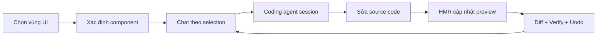
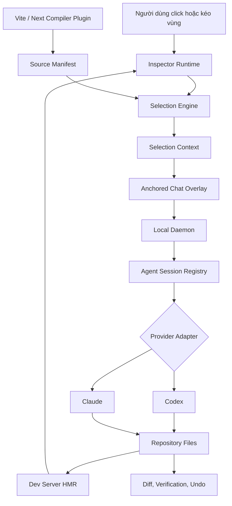

<div align="center">

# 🎯 PatchLens AI

### Select the interface. Tell the AI. Ship the patch.

**Visual AI coding for web interfaces**

PatchLens AI giúp lập trình viên chọn trực tiếp một vùng trên giao diện web, mở cuộc trò chuyện ngay tại vị trí đó và yêu cầu coding agent sửa đúng component trong source code.


</div>

---

## PatchLens AI là gì?

Khi làm giao diện bằng AI, vấn đề thường không phải AI không biết viết code. Vấn đề là AI **không biết chính xác phần nào trên màn hình mà người dùng đang muốn thay đổi**.

Người dùng có thể nói:

> Làm nút này nổi bật hơn.

Nhưng coding agent vẫn phải tự đoán:

- "Nút này" là element nào?
- Nó nằm trong component nào?
- File nào đang render component đó?
- Style đến từ CSS module, Tailwind, theme token hay component cha?
- Có được phép sửa những phần liên quan bên ngoài vùng chọn hay không?

PatchLens AI giải quyết khoảng cách giữa **thứ người dùng đang nhìn thấy** và **code mà AI cần chỉnh sửa**.

```text
Nhìn thấy giao diện
        ↓
Click hoặc kéo chọn một vùng
        ↓
PatchLens tìm component + file + dòng code
        ↓
Chat xuất hiện cạnh vùng đã chọn
        ↓
Codex / Claude nhận đúng visual context
        ↓
AI tự sửa repository
        ↓
HMR cập nhật giao diện và PatchLens hiển thị diff
```

## Trải nghiệm sản phẩm mong muốn

PatchLens AI được thiết kế như một development tool cài trực tiếp vào dự án Node.js.

```bash
npm install --save-dev @patchlens-ai/dev
npx patchlens init
npx patchlens connect codex
npm run patchlens
```

> [!IMPORTANT]
> Các command trên là **trải nghiệm cài đặt mục tiêu**. Repository hiện đang ở giai đoạn đầu và package chưa được phát hành.

Sau khi PatchLens Studio mở:

1. Dự án web được hiển thị trong một live preview.
2. Người dùng bật chế độ chọn giao diện.
3. Hover để xem element và component tương ứng.
4. Click để chọn chính xác một element hoặc kéo chuột để chọn một nhóm element.
5. Một khung chat xuất hiện ngay dưới hoặc bên cạnh vùng đã chọn.
6. Người dùng mô tả thay đổi bằng ngôn ngữ tự nhiên.
7. PatchLens gửi visual context và source context đến coding agent đang kết nối.
8. Agent tự sửa file trong repository.
9. Dev server HMR cập nhật preview.
10. PatchLens hiển thị kết quả, diff, verification và tùy chọn undo.

## Luồng tương tác cốt lõi



Mỗi vòng chat tiếp theo vẫn giữ liên kết với selection ban đầu. Người dùng không cần giải thích lại component hoặc gửi thủ công tên file cho AI.

## Điều làm PatchLens khác biệt

### Không chỉ gửi screenshot

Screenshot giúp AI hiểu giao diện, nhưng không đủ để xác định source code. PatchLens tạo một **Selection Context** gồm:

- Ảnh chụp riêng vùng được chọn.
- DOM subtree đã được làm sạch.
- Bounding rectangle và viewport.
- Computed styles quan trọng.
- Route đang mở.
- Component name.
- File, line và column trong source code.
- Những file style hoặc component liên quan.
- Console errors xuất hiện trước và sau thay đổi.

### Không bắt AI đoán component

Trong development build, PatchLens compiler plugin gắn metadata vào JSX/TSX:

```tsx
<button>Start now</button>
```

Được instrument thành metadata tương đương:

```html
<button data-patchlens-id="pl_a82f">Start now</button>
```

ID được ánh xạ trong local source manifest:

```json
{
  "pl_a82f": {
    "component": "HeroCTA",
    "file": "src/components/HeroCTA.tsx",
    "line": 42,
    "column": 8
  }
}
```

Metadata chỉ tồn tại trong development mode và không được đưa vào production build.

### Không phụ thuộc một AI duy nhất

PatchLens sử dụng một agent protocol chung. Studio và Inspector không cần biết agent bên dưới là Codex, Claude hay một provider khác.

```ts
interface CodingProvider {
  detect(): Promise<ProviderStatus>;
  createSession(input: CreateSessionInput): Promise<AgentSession>;
  sendMessage(
    session: AgentSession,
    request: AgentRequest
  ): AsyncIterable<AgentEvent>;
  cancel(session: AgentSession): Promise<void>;
}
```

Provider-specific logic được đặt trong adapter riêng:

- `provider-codex`
- `provider-claude`
- Các provider khác trong tương lai

## Hai chế độ kết nối coding agent

### 1. Managed session

PatchLens tự khởi tạo và quản lý coding agent session.

```text
PatchLens Studio
    → tạo Codex/Claude session
    → lưu provider session ID
    → gửi mọi chat tiếp theo vào cùng session
    → stream trạng thái và kết quả về Studio
```

Đây là chế độ chính để đạt trải nghiệm tự động hoàn chỉnh.

### 2. Attached session qua MCP

Người dùng vẫn làm việc trong Codex hoặc Claude ở bên ngoài PatchLens. Coding agent được kết nối với PatchLens MCP server và có thể gọi các tool:

```text
patchlens.get_active_selection
patchlens.get_selection_context
patchlens.get_source_context
patchlens.capture_preview
patchlens.get_console_errors
patchlens.verify_visual_change
```

Sau khi chọn một component trên preview, người dùng có thể nói với agent:

> Sửa vùng giao diện tôi đang chọn: làm CTA nổi bật hơn và giảm khoảng cách phía trên.

Agent lấy active selection từ PatchLens thay vì yêu cầu người dùng mô tả lại vị trí.

## Kiến trúc hệ thống



## Các thành phần chính

| Thành phần | Vai trò |
| --- | --- |
| **Studio** | Live preview, toolbar, selection state, anchored chat và diff viewer |
| **Inspector Runtime** | Hover, click, drag selection và visual overlay |
| **Selection Engine** | Biến DOM selection thành component candidates |
| **Compiler Plugin** | Gắn source metadata vào JSX/TSX trong development build |
| **Source Mapper** | Ánh xạ PatchLens ID về component, file và dòng code |
| **Local Daemon** | Quản lý project, file access, agent session và streaming |
| **Agent Protocol** | Giao thức chung cho Codex, Claude và provider khác |
| **MCP Server** | Cho coding agent bên ngoài truy cập active selection |
| **Patch Transaction** | Ghi nhận thay đổi của agent và hỗ trợ undo an toàn |
| **Visual Verifier** | So sánh preview trước/sau và phát hiện runtime errors |

## Cấu trúc monorepo dự kiến

```text
patchlens-ai/
├── apps/
│   ├── studio/                  # Preview, toolbar, chat, diff viewer
│   └── daemon/                  # Local server và agent session registry
│
├── packages/
│   ├── cli/                     # init, dev, connect, disconnect, doctor
│   ├── dev/                     # Package chính người dùng cài
│   ├── inspector-runtime/       # Hover, click và drag selection
│   ├── selection-engine/        # DOM rectangle → component candidates
│   ├── source-mapper/           # PatchLens ID → source location
│   ├── compiler-vite/           # React + Vite instrumentation
│   ├── compiler-next/           # Next.js instrumentation
│   ├── anchored-chat/           # Chat overlay độc lập với app CSS
│   ├── agent-protocol/          # Types, schema và agent events
│   ├── mcp-server/              # MCP tools cho external agents
│   ├── provider-codex/          # Codex adapter
│   ├── provider-claude/         # Claude adapter
│   ├── patch-transaction/       # Diff, checkpoint và undo
│   └── visual-verifier/         # Screenshot và runtime verification
│
├── examples/
│   └── react-vite-demo/
│
└── docs/
```

Người dùng chỉ cần cài một package. Các package con được giữ riêng để dễ kiểm thử, version và mở rộng framework/provider.

## Nguyên tắc an toàn

PatchLens cho phép AI tự động sửa code nên an toàn repository là một phần của kiến trúc, không phải tính năng bổ sung.

- Daemon chỉ bind vào `127.0.0.1` theo mặc định.
- Người dùng phải chọn hoặc cấp quyền cho project root.
- Mỗi request tạo một patch transaction riêng.
- Undo chỉ hoàn tác những thay đổi thuộc transaction của agent.
- Không sử dụng `git reset --hard` để triển khai undo.
- Không ghi đè thay đổi chưa commit của người dùng.
- Secret, password và input nhạy cảm phải bị loại khỏi DOM capture.
- PatchLens hiển thị provider nào sẽ nhận screenshot và source context.
- Agent phải báo cáo khi cần mở rộng phạm vi ra ngoài component được chọn.

## Phạm vi MVP

MVP đầu tiên tập trung vào một vertical slice nhỏ nhưng chạy được hoàn chỉnh:

```text
React + Vite
    → tự động gắn source metadata
    → hover/click/drag component
    → anchored chat
    → Codex managed session
    → agent sửa file
    → HMR cập nhật preview
    → diff + undo
```

### Có trong MVP

- React + Vite local project.
- Click để chọn một element.
- Drag để chọn một nhóm element.
- Source manifest với component/file/line.
- Anchored chat theo selection.
- Local daemon.
- Một Codex provider adapter.
- HMR, diff và undo transaction.

### Chưa nằm trong MVP

- Website bên ngoài hoặc cross-origin page.
- Browser extension.
- Production website instrumentation.
- Hỗ trợ mọi framework ngay từ đầu.
- Tự động điều khiển mọi cuộc chat Codex/Claude đang mở mà không có bridge.

## Roadmap

- [ ] **Phase 0 — Foundation:** pnpm monorepo, TypeScript, Studio, daemon và demo app.
- [ ] **Phase 1 — Visual selection:** Vite compiler plugin, source manifest và Inspector.
- [ ] **Phase 2 — Contextual chat:** Anchored chat và selection threads.
- [ ] **Phase 3 — Codex integration:** Managed session, streaming, file edits và HMR.
- [ ] **Phase 4 — MCP bridge:** Attached Codex session và agent tools.
- [ ] **Phase 5 — Claude + Next.js:** Provider và framework mở rộng.
- [ ] **Phase 6 — Visual verification:** Before/after capture, console checks và regression hints.

## Tiêu chí hoàn thành MVP

MVP được xem là hoàn thành khi:

- Cài được vào một React + Vite repository bằng command flow rõ ràng.
- Studio hiển thị live preview của dự án.
- Click hoặc drag trả về component và source location hợp lý.
- Chat giữ đúng selection context trong toàn bộ thread.
- Codex nhận được source, DOM và visual context.
- Agent sửa file và preview cập nhật bằng HMR.
- PatchLens hiển thị các file đã thay đổi.
- Người dùng có thể undo riêng thay đổi của agent.
- Production build không chứa PatchLens runtime.

## Định hướng dài hạn

PatchLens AI không hướng đến việc trở thành một trình tạo website riêng biệt. Mục tiêu là trở thành **visual context layer cho coding agents**.

Trong tương lai, bất kỳ coding agent nào cũng có thể hiểu các câu như:

- "Sửa phần tôi đang chọn."
- "Giữ layout nhưng đổi hierarchy của vùng này."
- "Component này bị lệch ở mobile, sửa mà không ảnh hưởng desktop."
- "So sánh với ảnh tham chiếu và chỉ cập nhật card đang chọn."
- "Tiếp tục chỉnh vùng trước đó nhưng dùng design token hiện tại."

PatchLens cung cấp phần ngữ cảnh còn thiếu để AI chuyển những yêu cầu đó thành thay đổi code chính xác và có thể kiểm chứng.

## Tài liệu kỹ thuật

Đặc tả kiến trúc và kế hoạch triển khai chi tiết nằm tại:

- [`PATCHLENS_IMPLEMENTATION_PLAN.md`](./PATCHLENS_IMPLEMENTATION_PLAN.md)

## Trạng thái dự án

PatchLens AI hiện đang ở giai đoạn **early development**. Kiến trúc và product flow đang được xây dựng trước, sau đó triển khai theo từng vertical slice có thể chạy và kiểm thử được.

Các API, command và package name trong README có thể thay đổi trong quá trình thử nghiệm.

---

<div align="center">

### Point. Prompt. Patch.

Built for developers who want AI to edit the interface they actually mean.

</div>
